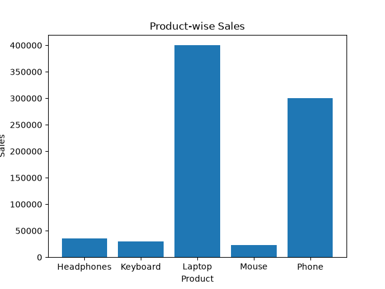
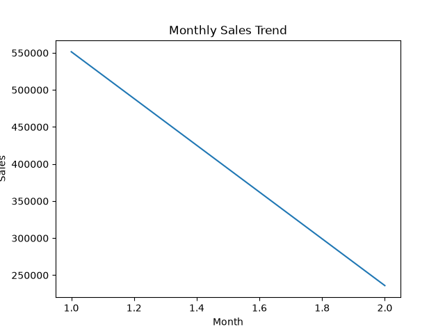
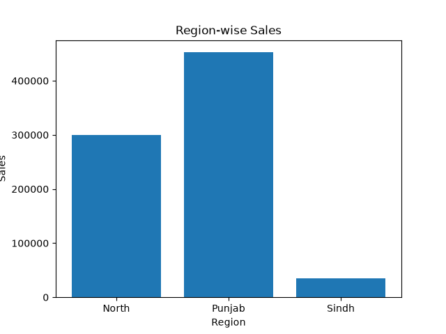
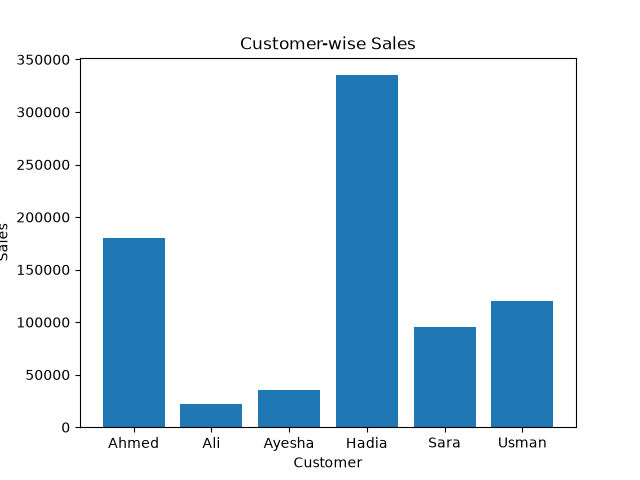

# Sales Data Analysis

A Python-based sales data analysis project built using Pandas and Matplotlib.

## Project Overview

This project analyzes sales data to identify product performance, city-wise sales, regional performance, customer sales, and monthly sales trends.

The project was developed as part of my 30-day Python internship preparation journey.

## Technologies Used

- Python
- Pandas
- Matplotlib
- CSV

## Project Features

- Load sales data from CSV
- Calculate total sales using Quantity × Price
- Product-wise sales analysis
- City-wise sales analysis
- Region-wise sales analysis
- Customer-wise sales analysis
- Monthly sales analysis
- Identify best-performing products
- Identify best-performing cities
- Identify best-performing regions
- Identify highest-sales customers
- Identify highest-sales month
- Generate sales visualizations
- Extract business insights

## Project Workflow

Raw Data
→ Data Processing
→ Sales Calculation
→ Grouped Analysis
→ Visualization
→ Business Insights

## Visualizations

### Product-wise Sales



### Monthly Sales Trend



### Region-wise Sales



### Customer-wise Sales



## Business Insights

1. Laptop generated the highest total sales among the analyzed products.
2. Punjab generated the highest regional sales.
3. January generated higher sales than February in the analyzed dataset.

## How to Run

1. Clone the repository.
2. Open the project folder.
3. Install the required libraries.

```bash
pip install pandas matplotlib